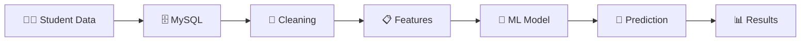

# 🎓 Student Performance Prediction & Management System

<p align="center">

### 🐍 Python  •  🗄️ MySQL  •  🤖 Machine Learning  •  📊 Analytics


**Manage students → Process data → Train ML → Predict performance → Analyze results**

</p>

---

## 💡 The Idea

> 🎯 **Turn student data into meaningful performance insights.**

This project combines **database management + data preprocessing + machine learning** in one practical application. Student records are stored in MySQL, processed using Python, and used to train a model for performance prediction.

---

## ✨ What Can It Do?

```text
┌─────────────────┐    ┌─────────────────┐
│ 👨‍🎓 STUDENTS   │    │ 🗄️ DATABASE    │
│                 │    │                 │
│ Add • Edit      │───▶│ MySQL Records   │
│ Search • Delete │    │ Persistent Data │
└─────────────────┘    └────────┬────────┘
                                │
                                ▼
┌─────────────────┐    ┌─────────────────┐
│ 🧹 DATA         │───▶│ 🤖 MACHINE      │
│ PROCESSING      │    │ LEARNING        │
│                 │    │                 │
│ Clean • Validate│    │ Train • Predict │
└─────────────────┘    └────────┬────────┘
                                │
                                ▼
                       ┌─────────────────┐
                       │ 📊 INSIGHTS     │
                       │                 │
                       │ Accuracy        │
                       │ Feature Impact  │
                       └─────────────────┘
```

---

## 🔄 ML Pipeline



---

## 🚀 Core Features

| 👨‍🎓 Management | 🧹 Processing |   🤖 ML  |     📊 Insights    |
| :--------------: | :-----------: | :------: | :----------------: |
|        Add       |     Clean     |   Train  |      Accuracy      |
|      Search      |    Validate   |  Predict | Feature Importance |
|       Edit       |    Prepare    | Evaluate |       Results      |
|      Delete      |    Process    |  Analyze |         📈         |

---

## 📸 Project Showcase

### 🖥️ Main Application

<!-- 📷 PLACE YOUR SCREENSHOT HERE -->

<br><br><br>

### 👨‍🎓 Student Management

<!-- 📷 PLACE YOUR SCREENSHOT HERE -->

<br><br><br>

### 🤖 ML Prediction

<!-- 📷 PLACE YOUR SCREENSHOT HERE -->

<br><br><br>

### 📊 Results & Analysis

<!-- 📷 PLACE YOUR SCREENSHOT HERE -->

<br><br><br>

---

## 🛠️ Tech Stack

```text
🐍 Python        → Application & ML Logic
🗄️ MySQL         → Persistent Student Data
🐼 Pandas        → Data Processing
🔢 NumPy         → Numerical Operations
🤖 Scikit-learn  → Machine Learning
🔧 Git/GitHub    → Version Control
```

---

## ⚡ Quick Start

```bash
git clone https://github.com/TGVASIYO/student-performance-prediction.git
cd student-performance-prediction
pip install -r requirements.txt
python main.py
```

---

## 🎯 What This Project Demonstrates

**Database Design** • **CRUD Operations** • **Data Cleaning**
**Machine Learning** • **Prediction** • **Model Evaluation**
**Feature Analysis** • **Python Programming** • **Git/GitHub**

---

## 👨‍💻 Author

**Priyabrata Patra**
🎓 *Integrated M.Tech — Artificial Intelligence | VIT Bhopal*

<p align="center">

### ⭐ Built with Python • MySQL • Machine Learning

**Student Data → Intelligence → Insights**

</p>


